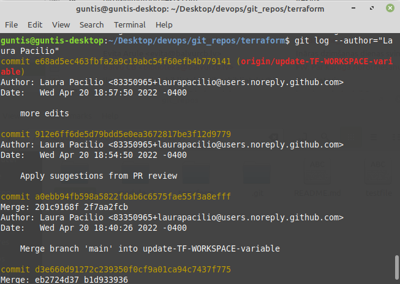

# 13. Salīdzināt vienādu failu (ne README) hash no mapes module_1 un module_2. Vai git redz atšķirību starp šiem failiem?

- guntis@guntis-desktop:~/Desktop/devops/git_repos/module_1$ git hash-object Screenshot_1.png
- d4012bac382c66af36721d032e05ecec45defa4b
- guntis@guntis-desktop:~/Desktop/devops/git_repos/module_1$ cd ..
- guntis@guntis-desktop:~/Desktop/devops/git_repos$ git hash-object module_2/Screenshot_1.png
- d4012bac382c66af36721d032e05ecec45defa4b

# 16. Pārbaudīt kādas izmaiņas tika veiktas iepriekšējās nedēļas laikā. Atrast
vismaz divus veidus kā to izdarīt.

Pēc kalendārajiem datumiem

Pēdējās 7 dienas

# 17. Atrast commit kurus veica autors - “Laura Pacilio”

#18. Atrast vai Laura ir veikusi commit pagājušā gada septembrī?

# 19. Vai Laura ir veikusi commit vakar?

Nav, 24.04.2022.

